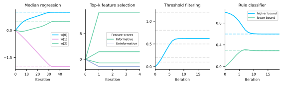

<p align="center">
  <picture>
    <source media="(prefers-color-scheme: dark)" srcset="docs/_static/logo/softjax_logo_white_transparent.png">
    <source media="(prefers-color-scheme: light)" srcset="docs/_static/logo/softjax_logo_black_transparent.png">
    
  </picture>
</p>

# Soft differentiable programming in JAX

[](https://pypi.org/project/softjax/)
[](https://pypi.org/project/softjax/)
[](https://github.com/a-paulus/softjax/blob/main/LICENSE)
[](https://arxiv.org/abs/2603.08824)

Looking for PyTorch? See [SoftTorch](https://github.com/a-paulus/softtorch).

## What is SoftJAX?

SoftJAX provides soft differentiable drop-in replacements for traditionally non-differentiable functions in [JAX](https://github.com/google/jax), including

- elementwise operators: `abs`, `relu`, `clip`, `sign`, `round` and `heaviside`;
- array-valued operators: `(arg)max`, `(arg)min`, `(arg)quantile`, `(arg)median`, `(arg)sort`, `(arg)top_k` and `rank`;
- comparison operators such as: `greater`, `equal` or `isclose`;
- logical operators such as: `logical_and`, `all` or `any`;
- selection operators such as: `where`, `take_along_axis`, `dynamic_index_in_dim` or `choose`.

All operators offer multiple modes and adjustable strength of softening, allowing for e.g. smoothness of the soft function or boundedness of the softened region, depending on the user needs.

Moreover, we tightly integrate functionality for deploying functions using [straight-through-estimation](https://docs.jax.dev/en/latest/advanced-autodiff.html#straight-through-estimator-using-stop-gradient), where we use non-differentiable functions in the forward pass and their differentiable replacements in the backward pass.

*Note, while SoftJAX is designed to provide direct drop-in replacements for JAX's operators, soft axis-wise operators return probability distributions over indices (instead of an index), effectively changing the shape of the function's output.*

## Installation
Requires Python 3.11+.
```
pip install softjax
```


## Documentation

Available at https://a-paulus.github.io/softjax/.


## Quick examples

**Robust median regression:**
Minimize the median absolute residual to be robust to outliers.
```python
import jax, jax.numpy as jnp, softjax as sj

key = jax.random.PRNGKey(0)
X = jax.random.normal(key, (20, 3))
w_true = jnp.array([1.0, -2.0, 0.5])
y = X @ w_true
y = y.at[0].set(1e6)  # inject outlier

def median_regression_loss(w, X, y, mode="smooth"):
    residuals = y - X @ w
    return sj.median(sj.abs(residuals, mode=mode), mode=mode)

w = jnp.zeros(3)
print("Hard grad:", jax.grad(median_regression_loss)(w, X, y, mode="hard"))
print("Soft grad:", jax.grad(median_regression_loss)(w, X, y, mode="smooth"))

for _ in range(50):
    w = w - 0.1 * jax.grad(median_regression_loss)(w, X, y)
print("Learned w:", w, " (true:", w_true, ")")
```
```
Hard grad: [-0.5108  0.4321 -0.0122]
Soft grad: [-0.8061  0.5254  0.099 ]
Learned w: [ 1.  -2.   0.5]  (true: [ 1.  -2.   0.5] )
```

**Top-k feature selection:**
Discover which features of a trained model are important.
```python
n_features, k = 10, 3
k1, k2 = jax.random.split(jax.random.PRNGKey(42))
X = jax.random.normal(k1, (100, n_features))
w_model = jnp.array([0, 2.0, 0, -1.5, 0, 0, 0, 5.0, 0, 0])
y = X @ w_model + 0.1 * jax.random.normal(k2, (100,))

def feature_selection_loss(g, X, y, w_model, mode="smooth"):
    _, soft_idx = sj.top_k(g, k=k, mode=mode, gated_grad=False)
    mask = soft_idx.sum(axis=0)
    y_pred = (X * mask) @ w_model
    return jnp.mean(sj.abs(y_pred - y))

g = jnp.zeros(n_features)
print("Hard grad:", jax.grad(feature_selection_loss)(g, X, y, w_model, mode="hard"))
print("Soft grad:", jax.grad(feature_selection_loss)(g, X, y, w_model, mode="smooth"))

for _ in range(5):
    g = g - 0.001 * jax.grad(feature_selection_loss)(g, X, y, w_model)
print("Selected features:", jax.lax.top_k(g, k=k)[1])
```
```
Hard grad: [0. 0. 0. 0. 0. 0. 0. 0. 0. 0.]
Soft grad: [  2268.416   -2371.1378   2268.416    1126.1998   2268.416    2268.416
   2268.416  -14633.9742   2268.416    2268.416 ]
Selected features: [7 1 3]
```

**Differentiable threshold filtering:**
Learn a threshold that gates inputs.
```python
x = jnp.array([0.2, 0.8, 0.5, 1.2, 0.1])
target_sum = 2.0  # sum of values above threshold = 2.0 (i.e. 0.8 + 1.2)

def filter_loss(t, x, target, mode="smooth"):
    mask = sj.greater(x, t, mode=mode)
    return (jnp.sum(mask * x) - target) ** 2

t = jnp.array(0.0)
print("Hard grad:", jax.grad(filter_loss)(t, x, target_sum, mode="hard"))
print("Soft grad:", jax.grad(filter_loss)(t, x, target_sum, mode="smooth"))

for _ in range(20):
    t = t - 0.1 * jax.grad(filter_loss)(t, x, target_sum)
print("Learned threshold:", t)
```
```
Hard grad: 0.0
Soft grad: -0.6600359275215457
Learned threshold: 0.6211048323197621
```

**Rule-based classifier:**
Learn decision boundaries `[lo, hi]` for a rule using soft logic and straight-through estimation. The rule is true if any element of a feature is inside `[lo, hi]`.
```python
x = jnp.array([[0.2, 0.8], [0.5, 0.3], [0.9, 0.1], [0.4, 0.7], [0.1, 0.4], [0.2, 0.7], [0.4, 0.1], [0.4, 0.7],
               [0.7, 0.29], [0.3, 0.3], [0.61, 0.25], [0.4, 0.6], [0.0, 0.1], [0.5, 0.3], [0.4, 0.9], [0.1, 0.57]])
labels = jnp.array([0.0, 1.0, 0.0, 1.0, 1.0, 0.0, 1.0, 1.0,
                    0.0, 1.0, 0.0, 1.0, 0.0, 1.0, 1.0, 1.0])

@sj.st
def rule_loss(params, x, labels, mode="smooth"):
    lo, hi = params[0], params[1]
    above = sj.greater(x, lo, mode=mode)
    below = sj.less(x, hi, mode=mode)
    in_range = sj.logical_and(above, below)
    preds = sj.any(in_range, axis=-1)
    return ((preds - labels) ** 2).sum()

params = jnp.array([0.0, 1.0])  # start with wide range [0, 1]
print("Hard grad:", jax.grad(rule_loss)(params, x, labels, mode="hard"))
print("Soft grad:", jax.grad(rule_loss)(params, x, labels, mode="smooth"))

for _ in range(20):
    params = params - 0.01 * jax.grad(rule_loss)(params, x, labels)
print("Learned [lo, hi]:", params)
```
```
Hard grad: [0. 0.]
Soft grad: [-4.2777  1.4152]
Learned [lo, hi]: [0.2925 0.5999]
```




## Citation

If this library helped your academic work, please consider citing: ([arXiv link](https://arxiv.org/abs/2603.08824))

```bibtex
@article{paulus2026softjax,
  title={{SoftJAX} \& {SoftTorch}: Empowering Automatic Differentiation Libraries with Informative Gradients},
  author={Paulus, Anselm and Geist, A.\ Ren\'e and Musil, V\'it and Hoffmann, Sebastian and Beker, Onur and Martius, Georg},
  journal={arXiv preprint},
  year={2026},
  eprint={2603.08824}
}
```

(Also consider starring the project [on GitHub](https://github.com/a-paulus/softjax))

Special thanks and credit go to [Patrick Kidger](https://kidger.site) for the awesome [JAX repositories](https://github.com/patrick-kidger) that served as the basis for the documentation of this project.


## Feedback

If you have any suggestions for improvement or other feedback, please [reach out](mailto:paulus.anselm@gmail.com) or raise a GitHub issue!


## See also

### Other libraries in the JAX ecosystem

**Always useful**  
[Equinox](https://github.com/patrick-kidger/equinox): neural networks and everything not already in core JAX!  
[jaxtyping](https://github.com/patrick-kidger/jaxtyping): type annotations for shape/dtype of arrays.  

**Deep learning**  
[Optax](https://github.com/deepmind/optax): first-order gradient (SGD, Adam, ...) optimisers.  
[Orbax](https://github.com/google/orbax): checkpointing (async/multi-host/multi-device).  
[Levanter](https://github.com/stanford-crfm/levanter): scalable+reliable training of foundation models (e.g. LLMs).  
[paramax](https://github.com/danielward27/paramax): parameterizations and constraints for PyTrees.  

**Scientific computing**  
[Diffrax](https://github.com/patrick-kidger/diffrax): numerical differential equation solvers.  
[Optimistix](https://github.com/patrick-kidger/optimistix): root finding, minimisation, fixed points, and least squares.  
[Lineax](https://github.com/patrick-kidger/lineax): linear solvers.  
[BlackJAX](https://github.com/blackjax-devs/blackjax): probabilistic+Bayesian sampling.  
[sympy2jax](https://github.com/patrick-kidger/sympy2jax): SymPy<->JAX conversion; train symbolic expressions via gradient descent.  
[PySR](https://github.com/milesCranmer/PySR): symbolic regression. (Non-JAX honourable mention!)  

**Awesome JAX**  
[Awesome JAX](https://github.com/n2cholas/awesome-jax): a longer list of other JAX projects.  

### Other libraries on differentiable programming

**Differentiable sorting, top-k and rank**  
[DiffSort](https://github.com/Felix-Petersen/diffsort): Differentiable sorting networks in PyTorch.  
[DiffTopK](https://github.com/Felix-Petersen/difftopk): Differentiable top-k in PyTorch.  
[FastSoftSort](https://github.com/google-research/fast-soft-sort): Fast differentiable sorting and rank in JAX.  
[Differentiable Top-k with Optimal Transport](https://gist.github.com/thomasahle/48e9b3f17ead6c3ef11325f25de3655e) in JAX.  
[SoftSort](https://github.com/sprillo/softsort): Differentiable argsort in PyTorch and TensorFlow.  

**Other**  
[DiffLogic](https://github.com/Felix-Petersen/difflogic): Differentiable logic gate networks in PyTorch.  
[SmoothOT](https://github.com/mblondel/smooth-ot): Smooth and Sparse Optimal Transport.  
[JaxOpt](https://github.com/google/jaxopt): Differentiable optimization in JAX.  

### Papers on differentiable algorithms
SoftJAX builds on / implements various different algorithms for e.g. differentiable `argtop_k`, `sorting` and `rank`, including:

[Projection onto the probability simplex: An efficient algorithm with a simple proof, and an application](https://arxiv.org/pdf/1309.1541)  
[Differentiable Ranks and Sorting using Optimal Transport](https://arxiv.org/pdf/1905.11885)  
[Differentiable Top-k with Optimal Transport](https://papers.nips.cc/paper/2020/file/ec24a54d62ce57ba93a531b460fa8d18-Paper.pdf)  
[SoftSort: A Continuous Relaxation for the argsort Operator](https://arxiv.org/pdf/2006.16038)  
[Sinkhorn Distances: Lightspeed Computation of Optimal Transportation Distances](https://arxiv.org/abs/1306.0895)  
[Smooth and Sparse Optimal Transport](https://arxiv.org/abs/1710.06276)  
[Smooth Approximations of the Rounding Function](https://arxiv.org/pdf/2504.19026v1)  
[Fast Differentiable Sorting and Ranking](https://arxiv.org/pdf/2002.08871)  
[Differentiable Sorting Networks for Scalable Sorting and Ranking Supervision](https://arxiv.org/abs/2105.04019)  

Please check the [API Documentation](https://a-paulus.github.io/softjax/api/softjax_operators) for implementation details.